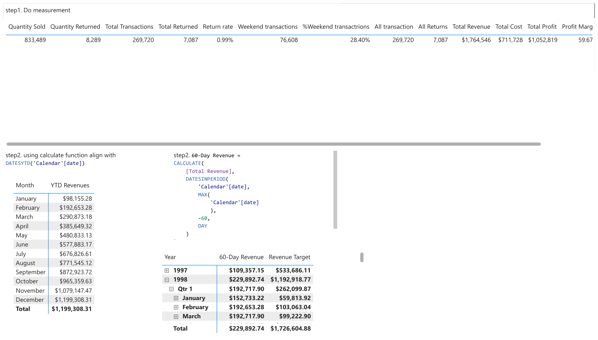

# Power BI Training → Executive Dashboard (Retail Analytics)

This repository documents my Power BI training project — from **data preparation & cleaning**, through **data modeling**, and finally building a complete **Executive Dashboard**.  
The purpose is to share my experience in designing, measuring, and visualizing business insights using Power BI.

---

## 1) Objectives and Dataset

- **Goal**: Build a full executive-level dashboard for retail analysis, covering sales, returns, transactions, and customer/store insights.  
- **Dataset**: Retail transaction dataset (training purpose).  
- **Key KPIs**:  
  - Total Transactions  
  - Total Revenue  
  - Total Profit  
  - Profit Margin %  
  - Total Returns & Return Rate %  
  - Weekend Transactions %  

---

## 2) Data Cleaning & Preparation

Before building measures and visuals, I performed data shaping in **Power Query** to ensure a reliable model:

- **Removed unnecessary columns** not relevant for analysis.  
- **Promoted headers** and validated column names for consistency.  
- **Data type corrections**:  
  - Converted dates to proper `date` format.  
  - Ensured numeric fields (quantity, cost, revenue) were set as `whole number` or `decimal`.  
  - Kept postal codes as `text`.  
- **New calculated columns**:  
  - `Full Name` = merged first and last names.  
  - `Birth Year` = extracted year from birthdate.  
  - `Has Children` = conditional column (`Y/N`).  
  - `House Number` = extracted from customer address (characters before first space).  
- **Date table**: Created a proper `Calendar` table with Year, Month, Quarter, Week Start, Day of Week.  
- **Deduplication & blanks**: Removed duplicate rows and replaced nulls with defaults (e.g., "Unknown" category).  
- **Standardization**: Normalized categorical values (e.g., member card levels: Silver, Gold, Bronze).  

---

## 3) Data Modeling (Star Schema)

- **Fact Table**: Transactional Sales Data (Quantity Sold, Quantity Returned, Revenue, Cost, Profit, Date, Customer, Store, Product).  
- **Dimension Tables**:  
  - Calendar Lookup (Date, Month, Quarter, Year)  
  - Customer Lookup (Demographics, Member Card, Marital Status)  
  - Product Lookup (Brand, Category, SKU)  
  - Store Lookup (Country, City, Sqft)  

Relationships were carefully set as **single-direction** where possible to avoid ambiguity.

---

## 4) Key Measurements (DAX)

Created calculated measures to support business analysis, e.g.:

- **Total Transactions**
```DAX
Total Transactions = SUM(Sales[Quantity Sold])
```

- **Return Rate %**
```DAX
Return Rate = DIVIDE([Total Returned], [Total Transactions])
```

- **Weekend Transactions**
```DAX
Weekend Transactions = 
CALCULATE([Total Transactions], 
    FILTER('Calendar', WEEKDAY('Calendar'[Date],2) >= 6))
```

- **Rolling 60-Day Revenue**
```DAX
60-Day Revenue = 
CALCULATE(
    [Total Revenue],
    DATESINPERIOD(
        'Calendar'[Date],
        MAX('Calendar'[Date]),
        -60,
        DAY
    )
)
```

- **YTD Revenue**
```DAX
YTD Revenues = 
CALCULATE(
    [Total Revenue],
    DATESYTD('Calendar'[Date])
)
```

---

## 5) Analysis Features

### Key Influencers
- Used Power BI **Key Influencers Visual** to identify drivers of higher transactions.  
- Example insights:  
  - Transactions increase significantly when `store_city = Spokane`.  
  - Larger `grocery_sqft` and higher `total_sqft` stores drive higher sales.  
  - Certain customer attributes (e.g., Bronze card, marital status) influence behavior.

### Segmentation
- Compared transactions by **country → city → store** to detect performance outliers.  
- Measured store size (sqft) vs. transaction volume.

### Executive Dashboard
- **KPI Cards**: Current month Transactions, Profit, Returns vs. Target.  
- **Maps**: Transactions by city & country.  
- **Treemap**: Country contribution to transactions.  
- **Table Heatmap**: Brand performance (Transactions, Profit, Margin, Return Rate).  
- **Time Series**: Revenue vs. Revenue Target.  
- **Gauge**: Progress toward monthly revenue goal.

---

## 6) Results & Learnings

- Built a clean **executive view** with KPIs, trends, and detailed breakdowns.  
- Learned to align **CALCULATE + time intelligence** functions for rolling periods and YTD measures.  
- Practiced using **Key Influencers** to extract non-obvious insights from data.  
- Designed visual hierarchy: summary KPIs → country-level breakdown → city/store → product brand.  
- Reinforced the importance of **data cleaning workflow** in Power Query before analysis.  

---

## 7) Dashboard Snapshots

### Key Influencers


### Detailed Measures


### Executive Dashboard


---

## 8) Future Improvements

To extend this project beyond training, I would consider:

- **Predictive modeling**: Forecasting revenue & transactions using Power BI’s built-in forecasting or Python/R integration.  
- **Advanced segmentation**: Customer lifetime value (CLV) and churn analysis.  
- **Automated refresh**: Connecting to live databases with scheduled refresh in Power BI Service.  
- **Row-level security**: Enabling country/store managers to see only their relevant data.  
- **What-if analysis**: Scenario modeling for store expansion or price changes.  

---

## 9) Conclusion

This project was a valuable exercise in turning raw transactional data into **actionable executive insights**.  
I practiced **data cleaning, data modeling, DAX calculations, and visualization design** in Power BI to build a professional dashboard useful for decision-making.

